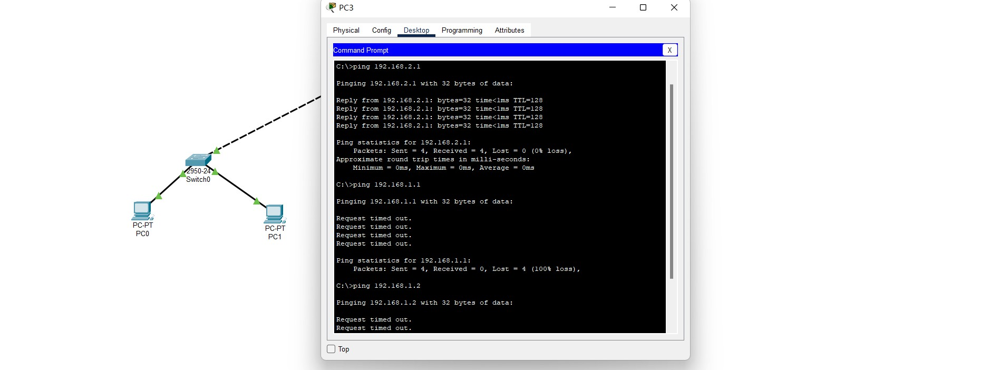

# 直接连接两台 PC 构建 LAN

步骤：
    1.打开Cisco Packet Tracer

    2.选择计算机设备

    3.选择连线

    4.电脑设置ip

    5.通过cmd互ping判断是否连接

# 用交换机构建 LAN

实验步骤：
1.找到相应设备
计算机是终端设备
交换机是网络设备

2.配置终端ip地址

问题：
1.PC0 能否 ping 通 PC1、PC2、PC3 ？

2.PC3 能否 ping 通 PC0、PC1、PC2 ？为什么？

3.将 4 台 PC 的掩码都改为 255.255.0.0 ，它们相互能 ping 通吗？为什么？

可以，在同一网络号下，掩码对应位数相同，可以相连

4.使用二层交换机连接的网络需要配置网关吗？为什么？

可以把一层交换机和二层交换机的关系当作终端与一层交换机关系考虑。只有设置好网关的IP地址，TCP/IP协议才能实现不同网络之间的相互通信。

# 交换机接口地址列表

这台设备连接ping过所以有一台电脑地址。

另一台没有，所以是空的

好吧，刚才点错了，点成计算机了，应该点一层交换机的，刚才哪个估计是正在连接。

现在对了，第二台计算机，连接了第三台，有多个mac地址了。

如何处理？
网上的答案
会发送广播，工作原理就和HUB一样了，我们可以先来了解一下交换机MAC地址表的建立过程。当交换机刚加电的时候，MAC地址表是没有内容的，主机之间谁也不知道谁的MAC地址，当主机A要和主机B通讯时，首先会发送一个ARP广播，想知道B的MAC地址，交换机收到该广播包，把主机A的MAC对应到MAC地址表里，与进入得端口匹配起来，然后转发该广播，主机B响应此广播包告诉主机A自己的MAC地址，交换机也同样纪录B的MAC地址与进入端口对应起来，这就是MAC地址表的建立过程，现在如果把MAC地址学习功能去掉的话，就只能在交换机里转发广播了！

# 生成树协议（Spanning Tree Protocol）

反正不能形成闭环，否则会发生网络风暴。

# 路由器配置初步

说明一：

说明二：

现实中，交通大学和重庆大学的连接是远程的。该连接要么通过路由器的光纤接口，要么通过广域网接口即所谓的 serial 口（如拓扑图所示）进行，一般不会通过双绞线连接（为什么？）。

双绞线就几百米传输效率高点，远了就不行，光纤更适合远距离传输

后面不知道怎么做了。

总结：学会了ciscopackertracer的基本使用，了解了不同设备之间的差别，和不同线之间的区别，还有网络协议之间的区别。

