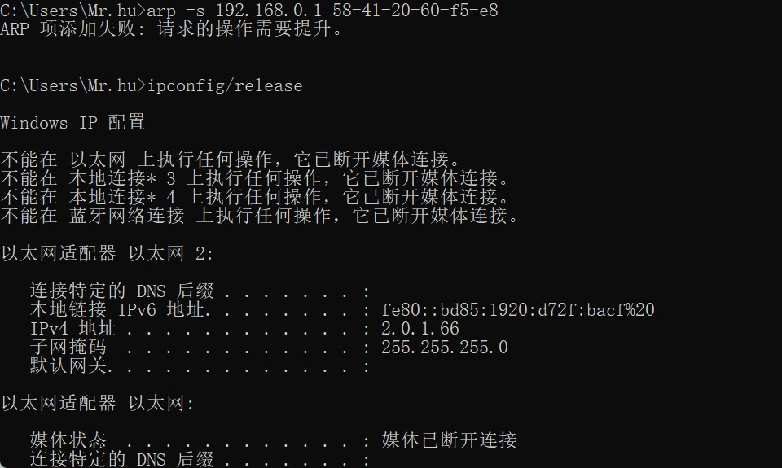
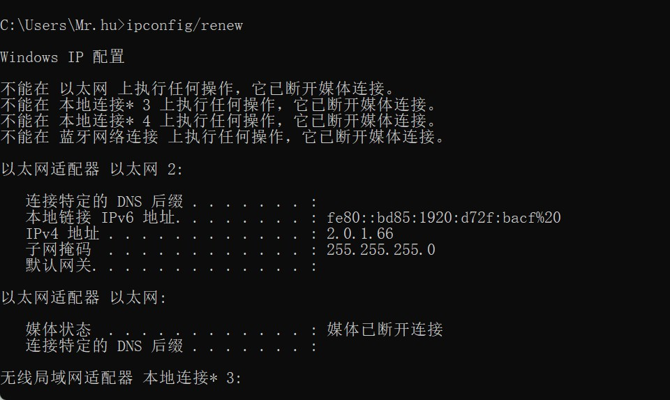

# 实作一

# DHCP是什么

动态主机配置协议DHCP（Dynamic Host Configuration Protocol）是一种网络管理协议，用于集中对用户IP地址进行动态管理和配置。
DHCP于1993年10月成为标准协议，其前身是BOOTP协议。DHCP协议由RFC 2131定义，采用客户端/服务器通信模式，由客户端（DHCP Client）向服务器（DHCP Server）提出配置申请，DHCP Server为网络上的每个设备动态分配IP地址、子网掩码、默认网关地址，域名服务器（DNS）地址和其他相关配置参数，以便可以与其他IP网络通信。

# 问题

在Windows系统下，如果由于某种原因计算机不能获取 DHCP 服务器的配置数据，那么Windows将会根据某种算法自动配置为 169.254.x.x 这样的 IP 地址。显然，这样的 IP 以及相关的配置信息是不能让我们真正接入 Internet 的，为什么？既然不能接入 Internet，那么Winodws系统采用这样的方案有什么意义？

网上找的：

这是Windows操作系统为了防止主机脱网，为网卡设置169.254.x.x的保留IP，此时就算由于某种原因计算机不能获取 DHCP 服务器的配置数据时，他们还通过保留地址还可以互相通讯。自动配置的IP地址和信息只是短暂性的解决计算机不能获取 DHCP 服务器的配置数据的问题，要真正的接入Internet还需要本身计算机的正确IP地址。

自己的想法：

相当于电脑的ip不行了，就临时用路由器的ip,要想正常联网还得电脑的IP正常。

经常的，在一个固定地方的网络配置我都喜欢采用 静态/手动配置，而不是动态 DHCP 来进行。你能想到是什么原因吗？

不用想也知道动态IP，会消耗额外的资源，没必要所以静态的好。