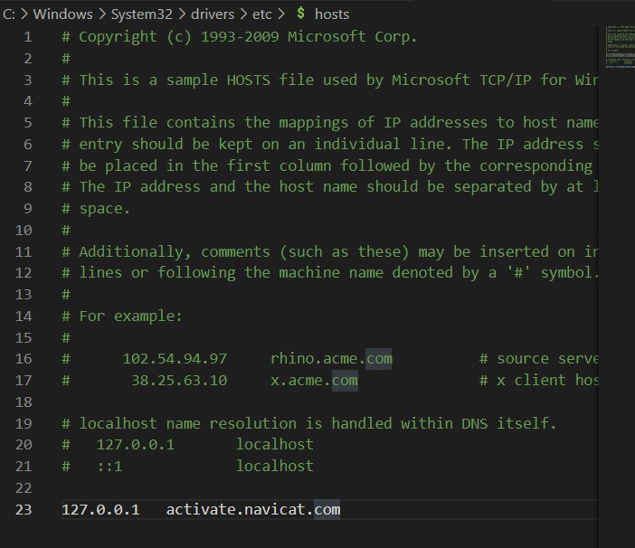

# 什么是DNS?

DNS 是计算机域名系统 (Domain Name System 或Domain Name Service) 的缩写，它是由解析器以及域名服务器组成的。

# 实作一

# 实作二

# 实作三

# 问题

上面秘籍中我们提到了使用插件或自己修改 hosts 文件来屏蔽广告，思考一下这种方式为何能过滤广告？如果某些广告拦截失效，那么是什么原因？你应该怎样进行分析从而能够成功屏蔽它？

hosts比DNS优先级高，用错误信息去屏蔽掉DNS上的信息。
具体情况请参考：https://www.cnblogs.com/hustskyking/p/hosts-modify.html

