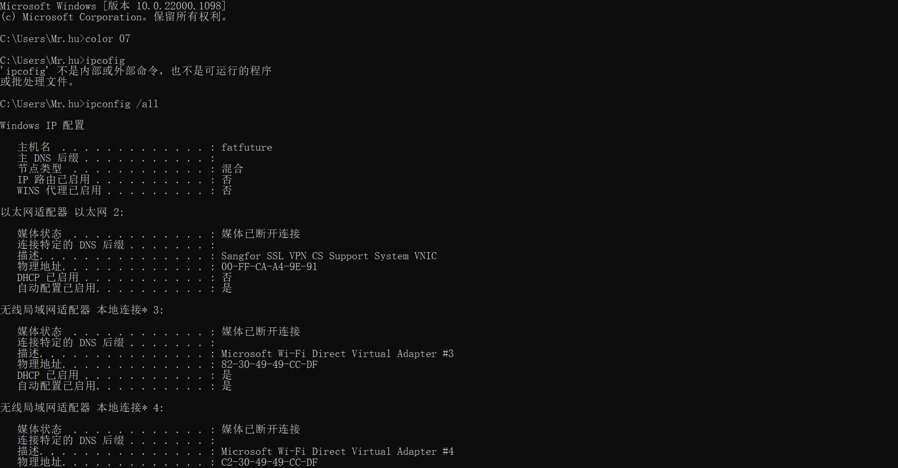

# ipconfig实操

## 实作1

### IP地址

以太网适配器 以太网:
IPv4 地址 . . . . . . . . . . . . : 10.60.52.76(首选)
以太网适配器 VMware Network Adapter VMnet1:
IPv4 地址 . . . . . . . . . . . . : 192.168.50.1(首选)
以太网适配器 VMware Network Adapter VMnet8:
IPv4 地址 . . . . . . . . . . . . : 192.168.86.1(首选)

#### 查找资料

网际协议版本4（英语：Internet Protocol version 4，IPv4），又称互联网通信协议第四版，是网际协议开发过程中的第四个修订版本，也是此协议第一个被广泛部署的版本。IPv4是互联网的核心，也是使用最广泛的网际协议版本，其后继版本为IPv6，直到2011年，IANA IPv4位址完全用尽时，IPv6仍处在部署的初期。
IPv4在IETF于1981年9月发布的 RFC 791 中被描述，此RFC替换了于1980年1月发布的 RFC 760。
IPv4是一种无连接的协议，操作在使用分组交换的链路层（如以太网）上。此协议会尽最大努力交付数据包，意即它不保证任何数据包均能送达目的地，也不保证所有数据包均按照正确的顺序无重复地到达。这些方面是由上层的传输协议（如传输控制协议）处理的。
2019年11月26日，全球所有43亿个IPv4地址已分配完毕，这意味着没有更多的IPv4地址可以分配给ISP和其他大型网络基础设施提供商。 [1] 

#### 总结

地址的一种形式

#### 自问自答

为什么我有三个，因为vMware 产生的 虚拟的ipv4地址

### 子网掩码 Subnet Mask

子网掩码  . . . . . . . . . . . . : 255.254.0.0

#### 查找资料

子网掩码(subnet mask)又叫网络掩码、地址掩码、子网络遮罩，它用来指明一个IP地址的哪些位标识的是主机所在的子网，以及哪些位标识的是主机的位掩码。子网掩码不能单独存在，它必须结合IP地址一起使用。
子网掩码是一个32位地址，用于屏蔽IP地址的一部分以区别网络标识和主机标识，并说明该IP地址是在局域网上，还是在广域网上。

#### 总结

将ip地址中网络地址和主机地址区分开，就是把子网掩码变成二进制，1对应的ip地址就是网络地址。

### 网关 Gateway

默认网关. . . . . . . . . . . . . : 10.60.255.254

#### 查找资料

网关是一种充当转换重任的计算机系统或设备，在使用不同的通信协议，数据格式或语言,甚至体系结构完全不同的两种系统时，网关是一个翻译器。与网桥只是简单地传送信息不同，网关对收到的信息要重新打包，以适应目的系统的需求。同时，网关也可以提供过滤和安全功能。

#### 总结

像中国人和外国人之间的翻译官，两个网络号之间的通信。
包的格式不同，所以需要重新打包。

## 实作2

未完成实验
我猜除了ip地址后几位应该都一样，因为在通用网段下；网关一样，共用一个路由设备。