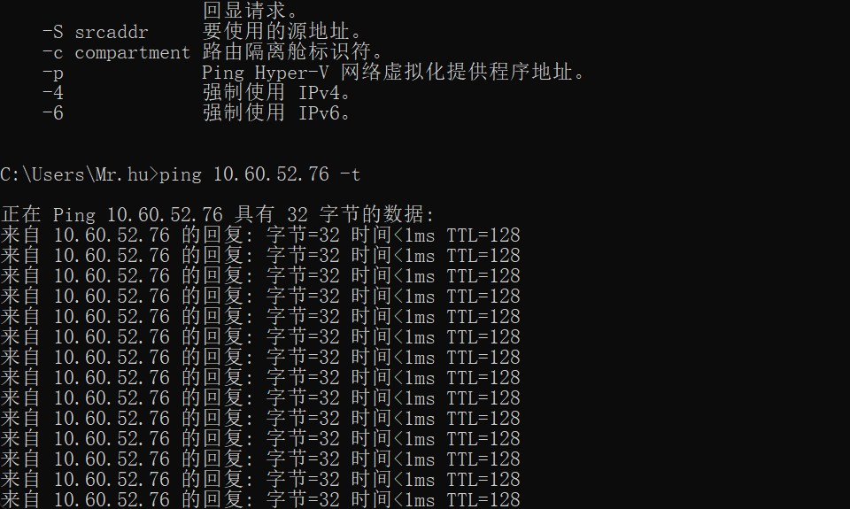
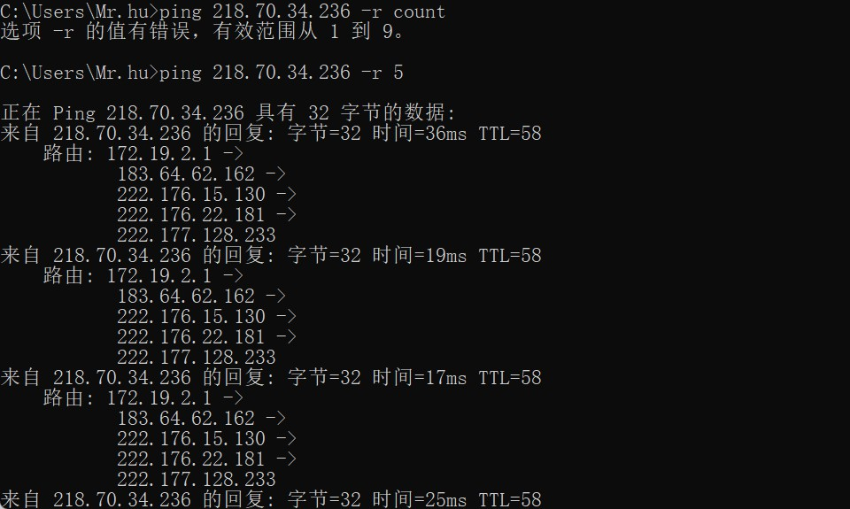
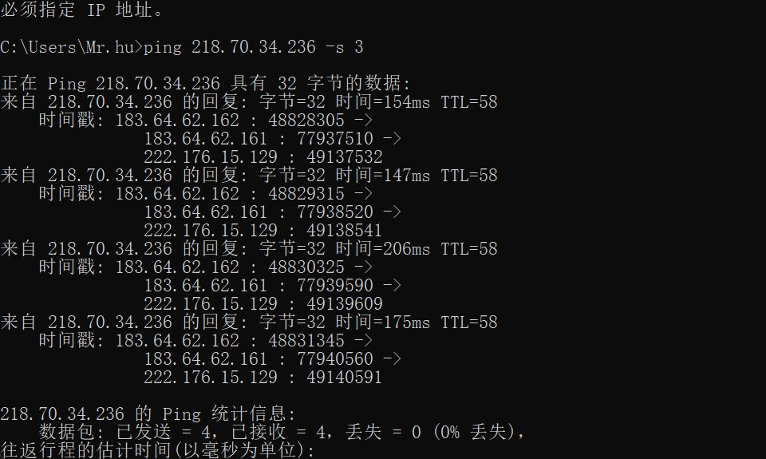

# ping实操

## 资料查询

ping用于确定本地主机是否能与另一台主机成功交换(发送与接收)数据包，再根据返回的信息，就可以推断TCP/IP参数是否设置正确，以及运行是否正常、网络是否通畅等。Ping命令可以进行以下操作 [3]  :
①通过将ICMP(Internet控制消息协议)回显数据包发送到计算机并侦听回显回复数据包来验证与一台或多台远程计算机的连接。
②每个发送的数据包最多等待一秒。
③打印已传输和接收的数据包数。
需要注意的是，Ping成功并不一定就代表TCP/IP配置正确，有可能还要执行大量的本地主机与远程主机的数据包交换，才能确信TCP/IP配置的正确性。如果执行ping成功而网络仍无法使用，那么问题很可能出在网络系统的软件配置方面，ping成功只保证当前主机与目的主机间存在一条连通的物理路径 [3]  

丢包（Packet loss）是指一个或多个数据数据包（packet）的数据无法透过网上到达目的地。丢包与比特错误（bit error）与噪声（noise）所造成的虚假的数据包（spurious packets）是三个最主要的数字通信错误的原因。

TTL是 Time To Live的缩写，该字段指定IP包被路由器丢弃之前允许通过的最大网段数量。

## 个人理解

ping 本地 确认配置是否成功

ping 其他机子 确认本机是否联网

把数据封装成一个个包，然后有的成功，有的没有，没有的就是丢的包

TTL就是在指定时间未完成的传输的包，将会被主动丢弃

# 实操2

# 备注

虽然TTL从字面上翻译，是可以存活的时间，但实际上TTL是IP数据包在计算机网络中可以转发的最大跳数。