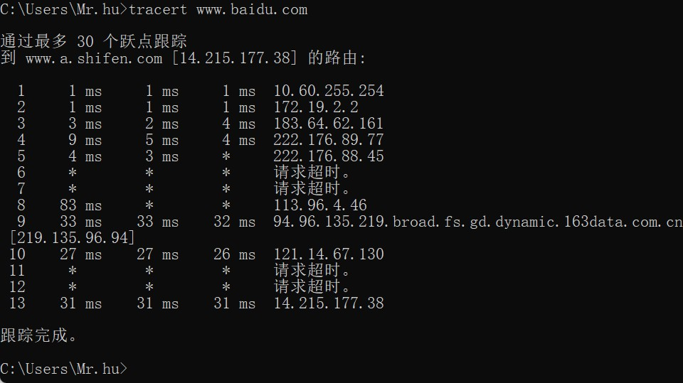
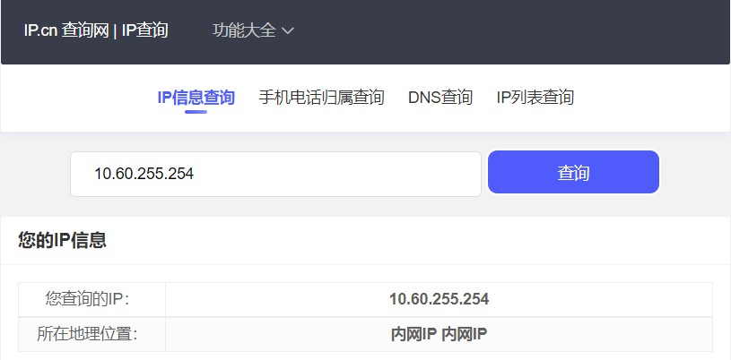
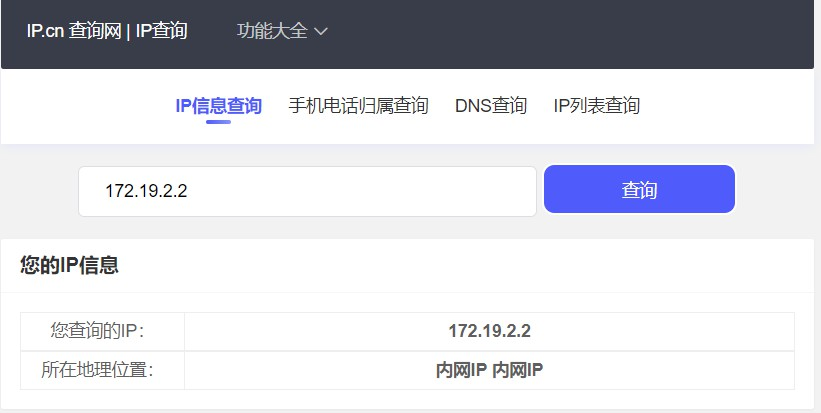
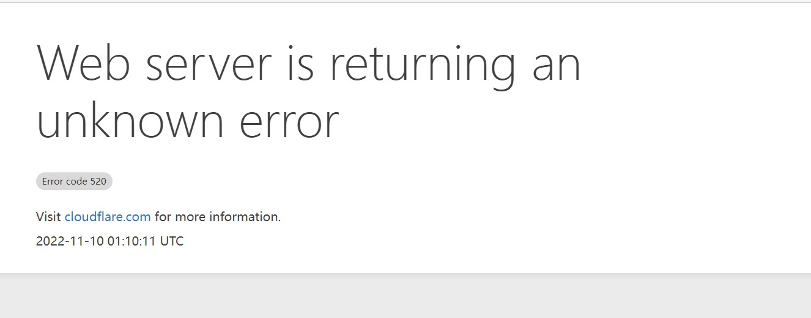
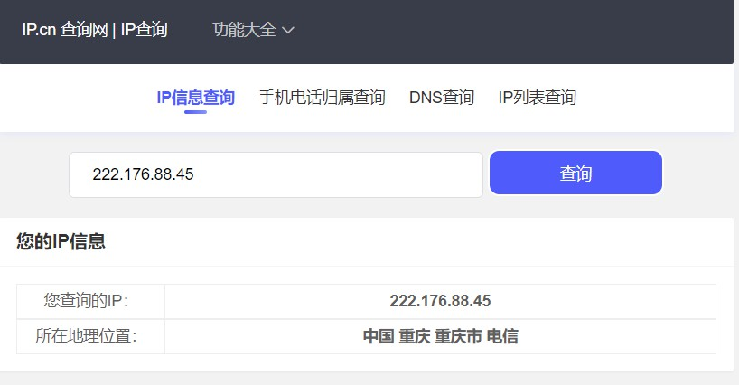
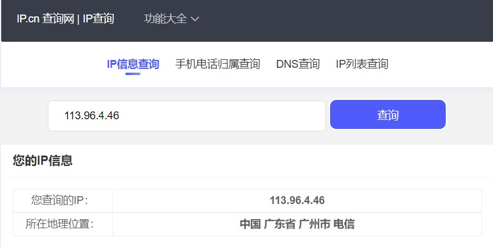
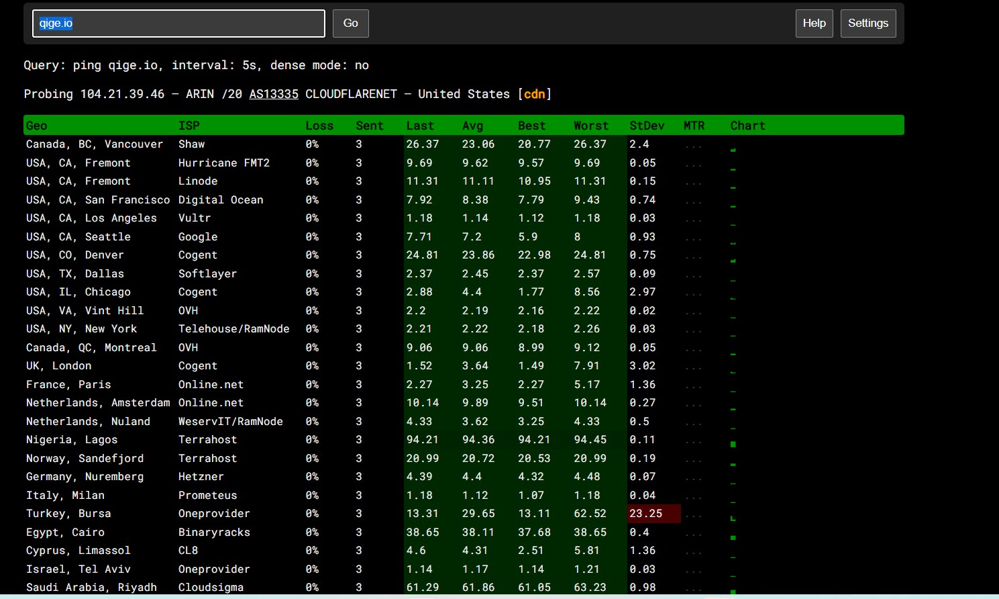

# 实作一

222.176.89.77 查不到

94.96.135.219.broad.fs.gd.dynamic.163data.com.cn [219.135.96.94]

为什么这个ip地址会这样？

问题解答：https://bbs.csdn.net/topics/110135487

https://blog.csdn.net/a13393665983/article/details/102191150?spm=1035.2023.3001.6557&utm_medium=distribute.pc_relevant_bbs_down_v2.none-task-blog-2~default~OPENSEARCH~Rate-1-102191150-bbs-120002244.pc_relevant_bbs_down_v2_default&depth_1-utm_source=distribute.pc_relevant_bbs_down_v2.none-task-blog-2~default~OPENSEARCH~Rate-1-102191150-bbs-120002244.pc_relevant_bbs_down_v2_default

# 实作2

isp:网络业务提供商(Internet Service Provider，简称ISP)，互联网服务提供商，即向广大用户综合提供互联网接入业务、信息业务、和增值业务的电信运营商。在互联网应用服务产业链“设备供应商——基础网络运营商——内容收集者和生产者——业务提供者——用户”中，ISP处于内容收集者、生产者以及业务提供者的位置。

# 在追踪过程中，你可能会看到路径中某些节点显示为 * 号，这是发生了什么？

需要注意的是，并不是所有网关都会如实返回 ICMP 超时报文。出于安全性考虑，大多数防火墙以及启用了防火墙功能的路由器缺省配置为不返回各种 ICMP 报文，其余路由器或交换机也可被管理员主动修改配置变为不返回 ICMP 报文。因此 Traceroute 程序不一定能拿全所有的沿途网关地址。所以，当某个 TTL 值的数据包得不到响应时，并不能停止这一追踪过程，程序仍然会把 TTL 递增而发出下一个数据包。一直达到默认或用参数指定的追踪限制（maximum_hops）才结束追踪。

# 在以上两个实作中，如果你留意路径中的节点，你会发现无论是访问百度还是棋歌教学网，路径中的第一跳都是相同的，甚至你应该发现似乎前几个节点都是相同的，你的解释是什么？

前几个是最优路径

# tracert 能告诉我们路径上的节点以及大致的延迟等信息，那么它背后的原理是什么？本问题可结合第二部分的 Wireshark 实验进行验证。

主叫方首先发出 TTL=1 的数据包，第一个路由器将 TTL 减1得0后就不再继续转发此数据包，而是返回一个 ICMP 超时报文，主叫方从超时报文中即可提取出数据包所经过的第一个网关地址。然后又发出一个 TTL=2 的 ICMP 数据包，可获得第二个网关地址，依次递增 TTL 便获取了沿途所有网关地址。