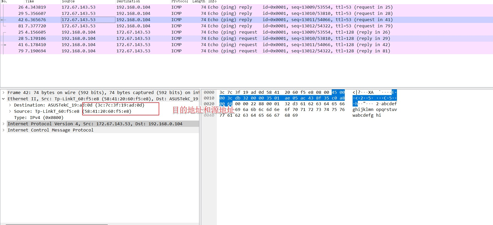
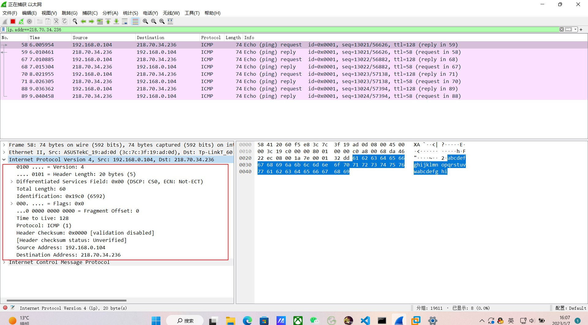
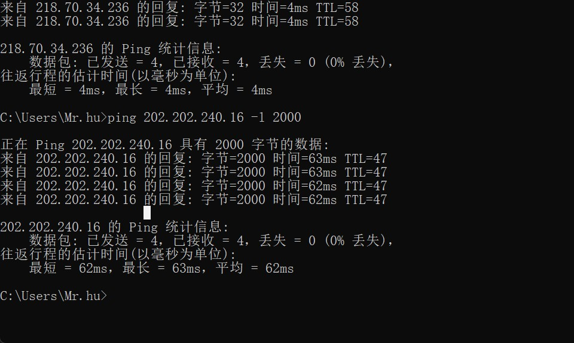

# 数据链路层

## 实作一 熟悉 Ethernet 帧结构

打开Wireshark

启动抓包

cmd 通过ping向百度发送数据包

通过ping向百度发送了三次数据包，百度回了一次。

## 实作二 了解子网内/外通信时的 MAC 地址

1.ping 你旁边的计算机（同一子网），同时用 Wireshark 抓这些包（可使用 icmp 关键字进行过滤以利于分析），记录一下发出帧的目的 MAC 地址以及返回帧的源 MAC 地址是多少？这个 MAC 地址是谁的？
就一台电脑，没法做
用虚拟机.net模式尝试了一下。

只可以单方向连接。

2.然后 ping qige.io （或者本子网外的主机都可以），同时用 Wireshark 抓这些包（可 icmp 过滤），记录一下发出帧的目的 MAC 地址以及返回帧的源 MAC 地址是多少？这个 MAC 地址是谁的？

3.再次 ping www.cqjtu.edu.cn （或者本子网外的主机都可以），同时用 Wireshark 抓这些包（可 icmp 过滤），记录一下发出帧的目的 MAC 地址以及返回帧的源 MAC 地址又是多少？这个 MAC 地址又是谁的？

通过以上的实验，你会发现：

访问本子网的计算机时，目的 MAC 就是该主机的
访问非本子网的计算机时，目的 MAC 是网关的
请问原因是什么？

一个是计算机的mac地址，一个是路由器的mac地址。因为ARP代理，访问非子网计算机时是通过路由器转接的，MAC地址是接入路由器端口的地址，再通过路由器发给相应计算机。

## 实作三 掌握 ARP 解析过程

没删掉

# 网络层

## 实作一 熟悉 IP 包结构

为提高效率，我们应该让 IP 的头部尽可能的精简。但在如此珍贵的 IP 头部你会发现既有头部长度字段，也有总长度字段。请问为什么？

太长了，要分段。在链路层发生。

# 实作二 IP 包的分段与重组

分段与重组是一个耗费资源的操作，特别是当分段由传送路径上的节点即路由器来完成的时候，所以 IPv6 已经不允许分段了。那么 IPv6 中，如果路由器遇到了一个大数据包该怎么办？

无所谓，上层会出手的。

# 实作三 考察 TTL 事件

在 IPv4 中，TTL 虽然定义为生命期即 Time To Live，但现实中我们都以跳数/节点数进行设置。如果你收到一个包，其 TTL 的值为 50，那么可以推断这个包从源点到你之间有多少跳？

64 128 选靠近50的

64-50=14

有14跳

# 传输层

## 实作一 熟悉 TCP 和 UDP 段结构

由上大家可以看到 UDP 的头部比 TCP 简单得多，但两者都有源和目的端口号。请问源和目的端口号用来干什么？
一个进程对应一个端口，端口是用来唯一标识这个进程。在传输层，源端口标识发起通信的那个进程，目的端口标识接受通信的那个进程，接受到报文根据端口号将报文发送到目的进程。

## 实作二 分析 TCP 建立和释放连接

去掉 Follow TCP Stream，即不跟踪一个 TCP 流，你可能会看到访问 qige.io 时我们建立的连接有多个。请思考为什么会有多个连接？作用是什么？
数据包传输有先后，并且发送了多次。

我们上面提到了释放连接需要四次挥手，有时你可能会抓到只有三次挥手。原因是什么？

可能还没抓过来吧。

# 应用层

## 实作一 了解 DNS 解析

你可能会发现对同一个站点，我们发出的 DNS 解析请求不止一个，思考一下是什么原因？

DNS里的那张表在时刻发生变化。

## 实作二 了解 HTTP 的请求和应答

HTTP定义了与服务器进行交互的不同方法，常见的有四种：GET、POST、PUT、DELETE。其中，GET和POST最常用。

GET用来获取资源，它只是获取、查询数据，不会修改服务器的数据，从这点来讲，它是安全的（后面还会从另一方面分析它的不安全性）。由于它是读取的，因此可以对GET请求的数据进行缓存。

